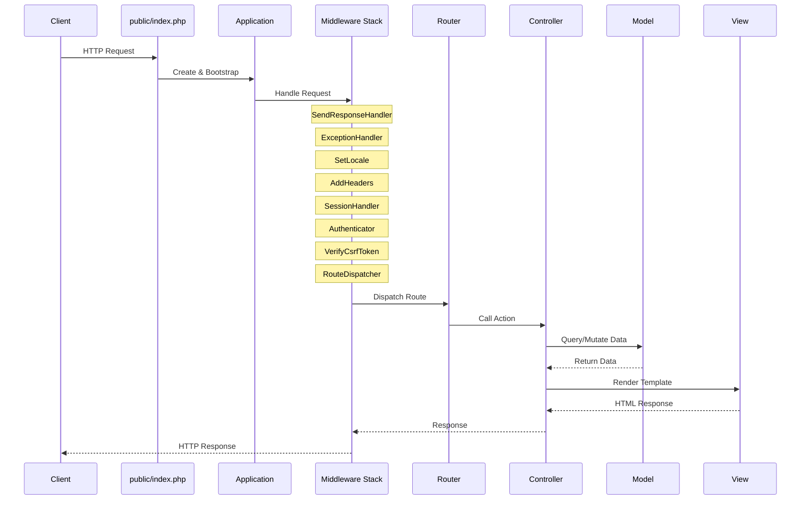
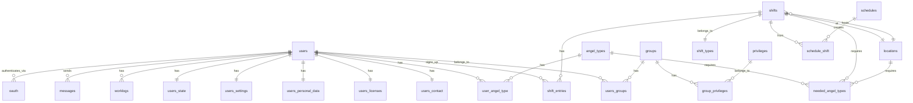

# Technical Architecture

## Tech Stack

### Backend
| Component | Technology | Version |
|-----------|------------|---------|
| Language | PHP | >= 8.2 |
| Container | Custom DI Container | - |
| ORM | Eloquent (illuminate/database) | ^12.39 |
| Routing | FastRoute (nikic/fast-route) | ^1.3 |
| Templating | Twig | ^3.22 |
| HTTP | PSR-7 (nyholm/psr7) | ^1.8 |
| HTTP Server | nyholm/psr7-server | ^1.1 |
| Validation | respect/validation | ^2.3 |
| Markdown | erusev/parsedown | ^1.7 |
| Calendar | eluceo/ical | ^2.16 |

### Frontend
| Component | Technology | Version |
|-----------|------------|---------|
| CSS Framework | Bootstrap | ^5.3 |
| Build Tool | Webpack | ^5.97 |
| JS/TS | TypeScript | ^5.7 |
| Icons | Bootstrap Icons | ^1.11 |
| Charts | Chart.js | ^4.4 |
| i18n | @cospired/i18n-iso-languages | ^4.3 |

### Development Tools
| Tool | Purpose |
|------|---------|
| PHPUnit | Testing |
| PHPStan | Static analysis |
| PHP_CodeSniffer | Code style |
| ESLint | JS linting |
| Prettier | Code formatting |

### Infrastructure
| Component | Technology |
|-----------|------------|
| Database | MySQL/MariaDB |
| Package Manager | Composer (PHP), Yarn (JS) |
| Build System | Nix Flake |
| CI/CD | GitLab CI |
| Containerization | Docker/Kubernetes |

## Application Architecture

### Directory Structure

```
engelsystem/
├── bin/                    # CLI scripts
│   └── migrate             # Database migration runner
├── config/                 # Configuration files
│   ├── app.php            # Service providers, middleware, routes
│   ├── config.default.php # Default configuration values
│   └── routes.php         # Route definitions
├── db/                     # Database related
│   ├── factories/         # Eloquent model factories
│   └── migrations/        # Database migrations (110+)
├── docker/                 # Docker configuration
├── includes/               # Legacy include files
│   ├── controller/        # Legacy controllers
│   ├── helper/            # Helper functions
│   ├── model/             # Legacy model functions
│   ├── pages/             # Page rendering functions
│   └── view/              # View helper functions
├── nix/                    # Nix build configuration
│   ├── apps.nix           # Runnable applications
│   ├── checks.nix         # Test/lint checks
│   ├── database.nix       # Database helpers
│   ├── devshell.nix       # Development shell
│   ├── docker.nix         # Docker image build
│   ├── lib.nix            # Shared library definitions
│   ├── nixos-module.nix   # NixOS module
│   └── packages/          # Package definitions
├── public/                 # Web root
│   ├── assets/            # Static assets
│   └── index.php          # Application entry point
├── resources/              # Resources
│   ├── api/               # OpenAPI specification
│   ├── assets/            # Source assets (JS/SCSS)
│   ├── lang/              # Translations (gettext)
│   └── views/             # Twig templates
├── src/                    # PHP source code
│   ├── Config/            # Configuration handling
│   ├── Controllers/       # HTTP controllers
│   ├── Events/            # Event classes
│   ├── Exceptions/        # Custom exceptions
│   ├── Factories/         # Factory classes
│   ├── Helpers/           # Helper classes
│   ├── Http/              # HTTP handling
│   ├── Mail/              # Email handling
│   ├── Middleware/        # PSR-15 middleware
│   ├── Models/            # Eloquent models
│   ├── Renderer/          # Template rendering
│   └── Services/          # Service classes
├── storage/               # Runtime storage
│   └── logs/              # Application logs
└── tests/                 # Test suites
    ├── Feature/           # Integration tests
    └── Unit/              # Unit tests
```

### Request Lifecycle



### Service Provider Architecture

The application uses a service provider pattern for dependency injection:

```php
// config/app.php
'providers' => [
    LoggerServiceProvider::class,       // Logging
    ExceptionServiceProvider::class,    // Exception handling
    ConfigServiceProvider::class,       // Configuration
    DatabaseServiceProvider::class,     // Database connection
    SessionServiceProvider::class,      // Session handling
    AuthServiceProvider::class,         // Authentication
    TranslationServiceProvider::class,  // i18n
    RendererServiceProvider::class,     // Twig templating
    RouterServiceProvider::class,       // Routing
    MailerServiceProvider::class,       // Email
    EventsServiceProvider::class,       // Event dispatcher
    // ... and more
],
```

Each provider:
1. Registers services in the DI container
2. Optionally boots after all providers are registered
3. Can depend on other providers

### Middleware Stack

Request processing flows through middleware in order:

| Order | Middleware | Purpose |
|-------|-----------|---------||
| 1 | SendResponseHandler | Sends final response to client |
| 2 | ExceptionHandler | Catches and handles exceptions |
| 3 | SetLocale | Sets user's preferred language |
| 4 | AddHeaders | Adds security headers |
| 5 | SessionHandler | Manages session |
| 6 | Authenticator | Authenticates user |
| 7 | VerifyCsrfToken | CSRF protection |
| 8 | RouteDispatcher | Routes to controller |

### Event System

Engelsystem uses an event-driven architecture for certain operations:

```php
// config/app.php
'event-handlers' => [
    'message.created' => [...],     // Message notifications
    'news.created' => [...],        // News notifications
    'oauth2.login' => [...],        // OAuth callbacks
    'shift.entry.deleting' => [...], // Shift notifications
],
```

## Database Architecture

### Schema Overview

The database contains 40+ tables organized around core entities:



### Key Tables

| Table | Purpose |
|-------|---------|
| `users` | User accounts |
| `users_contact` | Contact information (DECT, mobile, email) |
| `users_personal_data` | Personal info (name, shirt size, dates) |
| `users_state` | User state (arrived, active, got_shirt, etc.) |
| `users_settings` | User preferences (language, theme, email settings) |
| `groups` | Permission groups |
| `privileges` | Individual permissions |
| `angel_types` | Types of volunteer work |
| `user_angel_type` | User qualifications (pivot) |
| `shifts` | Scheduled work shifts |
| `shift_types` | Categories of shifts |
| `shift_entries` | User signups for shifts |
| `locations` | Physical locations |
| `needed_angel_types` | Required angels per shift/location/type |
| `schedules` | External schedule imports |
| `news` | Announcements |
| `messages` | Internal messaging |
| `questions` | Q&A system |
| `worklogs` | Manual work hour entries |
| `log_entries` | Audit log |
| `sessions` | User sessions |
| `oauth` | OAuth provider links |

### Migrations

Located in `db/migrations/`, numbered chronologically:
- 110+ migration files
- Use Illuminate Database migrations
- Support for rollback

Example migration:
```php
// 2024_01_01_000000_create_example_table.php
class CreateExampleTable extends Migration
{
    public function up(): void
    {
        $this->schema->create('example', function (Blueprint $table) {
            $table->id();
            $table->string('name');
            $table->timestamps();
        });
    }

    public function down(): void
    {
        $this->schema->dropIfExists('example');
    }
}
```

## Model Layer

### Base Model

All models extend `BaseModel` which extends Eloquent's `Model`:

```php
namespace Engelsystem\Models;

abstract class BaseModel extends Model
{
    // Connection name
    protected $connection = 'default';

    // Timestamps disabled by default
    public $timestamps = false;
}
```

### Key Models

**User Model** (`src/Models/User/User.php`):
```php
class User extends BaseModel
{
    protected $fillable = ['name', 'password', 'email', 'api_key', 'last_login_at'];
    protected $hidden = ['api_key', 'password'];

    // Relationships
    public function contact(): HasOne;
    public function groups(): BelongsToMany;
    public function userAngelTypes(): BelongsToMany;
    public function shiftEntries(): HasMany;
    public function worklogs(): HasMany;
    // ... many more

    // Business logic
    public function isFreeloader(): bool;
    public function isAngelTypeSupporter(AngelType $angelType): bool;
}
```

**Shift Model** (`src/Models/Shifts/Shift.php`):
```php
class Shift extends BaseModel
{
    protected $fillable = [
        'title', 'description', 'url', 'start', 'end',
        'shift_type_id', 'location_id', 'transaction_id',
        'created_by', 'updated_by'
    ];

    // Relationships
    public function shiftType(): BelongsTo;
    public function location(): BelongsTo;
    public function shiftEntries(): HasMany;
    public function neededAngelTypes(): HasMany;
    public function schedule(): HasOneThrough;

    // Business logic
    public function isNightShift(): bool;
    public function getNightShiftMultiplier(): float;
    public function nextShift(): ?Shift;
    public function previousShift(): ?Shift;
}
```
