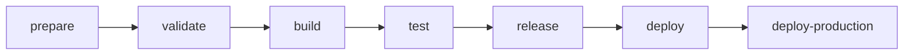
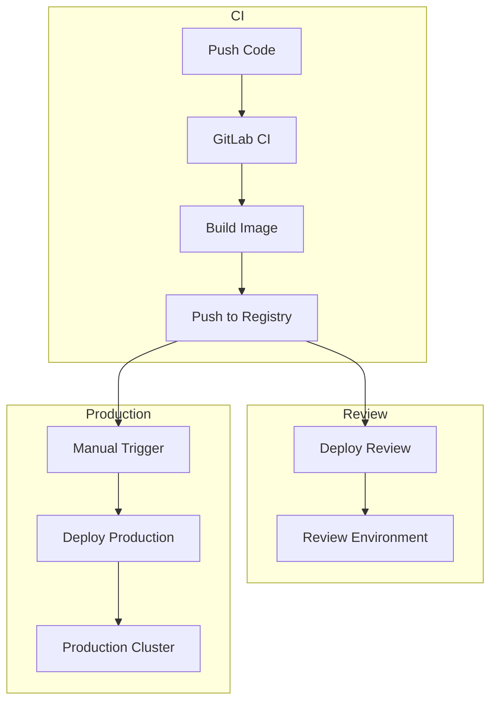

# CI/CD Pipeline Documentation

## Overview

Engelsystem uses GitLab CI/CD for continuous integration and deployment. The pipeline is defined in `.gitlab-ci.yml`.

## Pipeline Stages



### 1. Prepare Stage

**Jobs:**
- `composer-install` - Install PHP dependencies
- `yarn-install` - Install Node.js dependencies

**Artifacts:**
- `vendor/` directory
- `node_modules/` directory

### 2. Validate Stage

**Jobs:**

| Job | Tool | Purpose |
|-----|------|---------|
| `composer-validate` | Composer | Validate composer.json |
| `composer-audit` | Composer | Security audit of PHP dependencies |
| `yarn-validate` | Yarn | Validate package.json |
| `yarn-audit` | Yarn | Security audit of JS dependencies |
| `phpcs` | PHP_CodeSniffer | PHP code style |
| `phpstan` | PHPStan | Static analysis |
| `eslint` | ESLint | JavaScript linting |

### 3. Build Stage

**Jobs:**

- `yarn-build` - Build frontend assets
  - Input: `resources/assets/`
  - Output: `public/assets/`

- `kaniko-build` - Build Docker image (on protected branches)
  - Uses Kaniko for containerized builds
  - Pushes to container registry

### 4. Test Stage

**Jobs:**

- `phpunit` - Run test suite
  - Services: MariaDB 10.7
  - Coverage: Enabled
  - Artifacts: Coverage reports, JUnit XML

**Test Configuration:**
```yaml
phpunit:
  stage: test
  services:
    - mariadb:10.7
  variables:
    MYSQL_DATABASE: engelsystem
    MYSQL_USER: engelsystem
    MYSQL_PASSWORD: engelsystem
    MYSQL_ROOT_PASSWORD: engelsystem
  script:
    - php -d pcov.enabled=1 vendor/bin/phpunit --coverage-text --coverage-cobertura=coverage.xml --log-junit=report.xml
  coverage: '/^\s*Lines:\s*\d+.\d+\%/'
  artifacts:
    reports:
      coverage_report:
        coverage_format: cobertura
        path: coverage.xml
      junit: report.xml
```

### 5. Release Stage

**Jobs:**

- `tag-release` - Tag Docker image for release (on tags)

### 6. Deploy Stage

**Jobs:**

- `deploy-review` - Deploy review environments
  - Triggered on merge requests
  - Creates temporary environments
  - URL: `https://{branch}.review.engelsystem.example.com`

### 7. Deploy Production Stage

**Jobs:**

- `deploy-production` - Deploy to production
  - Manual trigger required
  - Only on protected branches
  - Kubernetes deployment

## Variables and Secrets

**Required CI/CD Variables:**

| Variable | Description | Protected |
|----------|-------------|-----------|
| `CI_REGISTRY_IMAGE` | Container registry URL | No |
| `KUBE_CONFIG` | Kubernetes config | Yes |
| `KUBE_NAMESPACE` | Deployment namespace | No |

## Local CI Testing

Test pipeline jobs locally:

```bash
# Using Nix
nix flake check

# Individual checks
nix run .#check-phpcs
nix run .#check-phpstan
nix run .#check-phpunit
```

## Nix-Based CI Alternative

The Nix flake provides equivalent checks:

```nix
# flake.nix
checks = {
  phpunit = ...;
  phpcs = ...;
  phpstan = ...;
  # etc.
};
```

Run all checks:
```bash
nix flake check
```

## Docker Image

The CI pipeline builds a Docker image:

**Base:** PHP 8.2 + Apache/nginx

**Included:**
- PHP with required extensions
- Compiled frontend assets
- Vendor dependencies (production only)

**Not included:**
- Development dependencies
- Test files
- Git history

## Deployment Architecture



## Kubernetes Resources

The deployment creates:

1. **Deployment** - Application pods
2. **Service** - Internal networking
3. **Ingress** - External access
4. **ConfigMap** - Configuration
5. **Secret** - Sensitive data
6. **PersistentVolumeClaim** - Storage (if needed)

## Rollback

To rollback a deployment:

```bash
# Kubernetes
kubectl rollout undo deployment/engelsystem

# Or redeploy previous version
kubectl set image deployment/engelsystem engelsystem=registry/engelsystem:previous-tag
```
