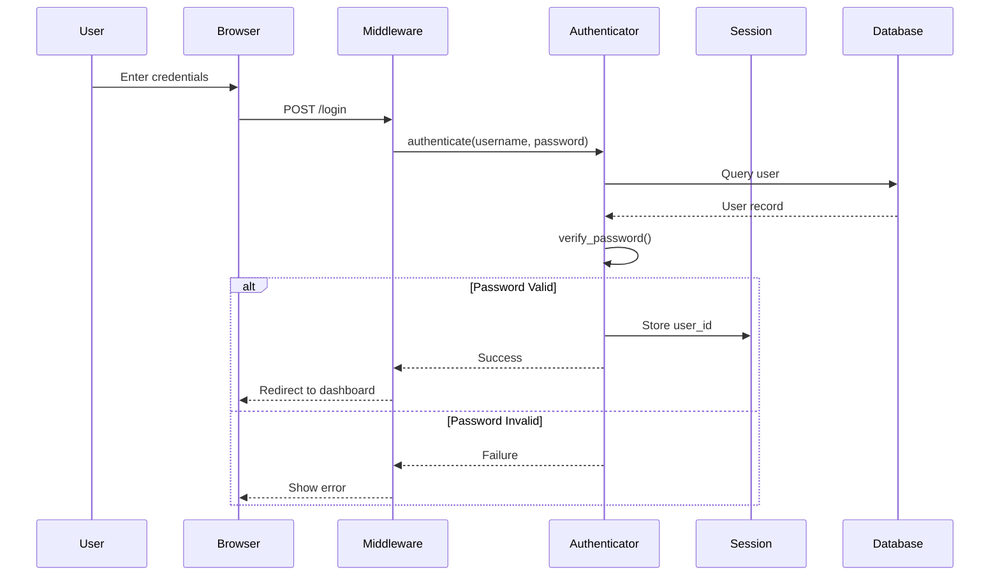
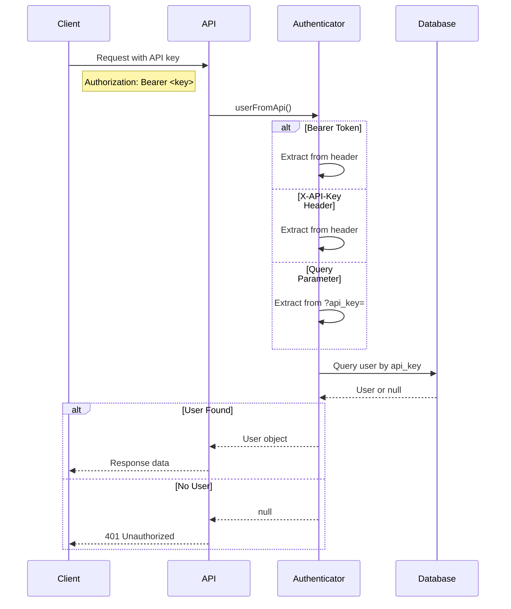
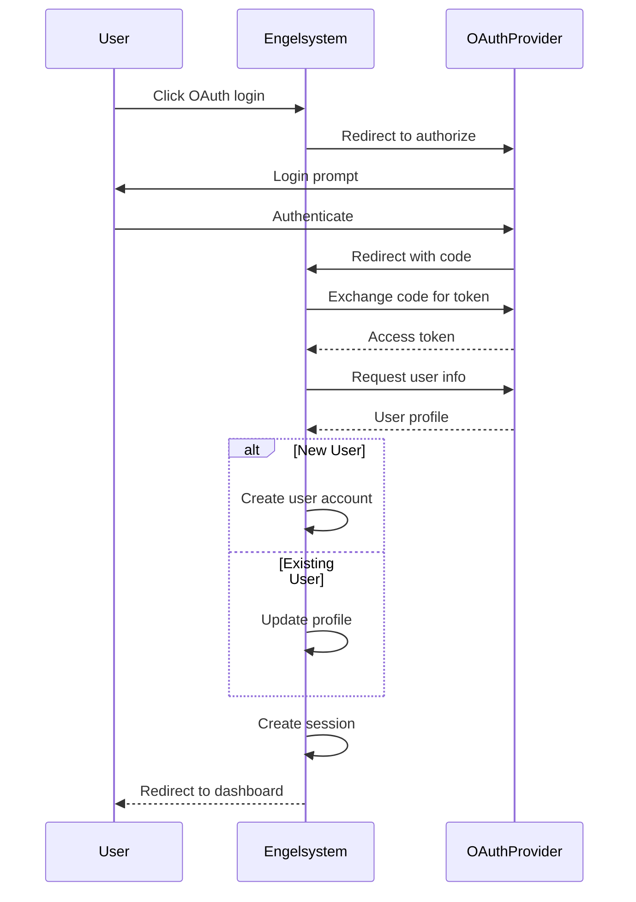
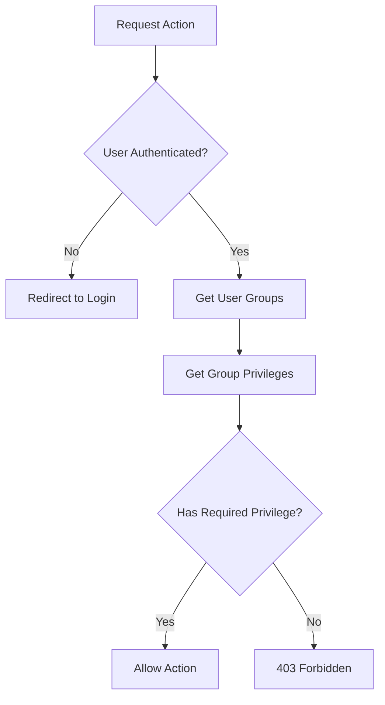

# Authentication Flow

## Session-Based Authentication (Web)



## API Key Authentication



## OAuth 2.0 Flow



## Permission Checking



## Password Hashing

The system uses PHP's password_hash with automatic algorithm upgrades:

```php
// During login
if (password_needs_rehash($user->password, PASSWORD_DEFAULT)) {
    $user->password = password_hash($plaintext, PASSWORD_DEFAULT);
    $user->save();
}
```
