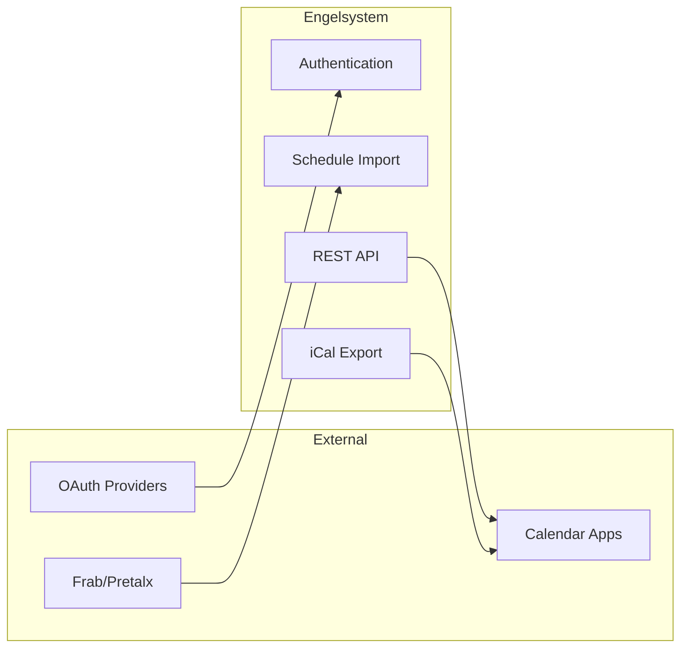

# Data Flows Overview

This section documents how data moves through Engelsystem.

## Key Data Flows

- [Authentication Flow](authentication.md) - How users authenticate
- [Shift Assignment Flow](shift-assignment.md) - How shifts get assigned to users

## System Integration Points

