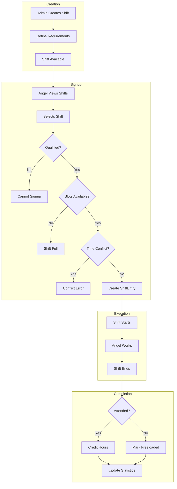
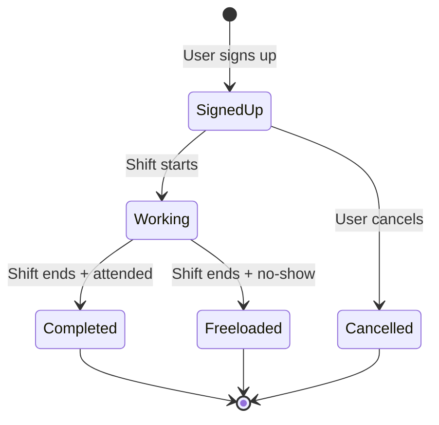
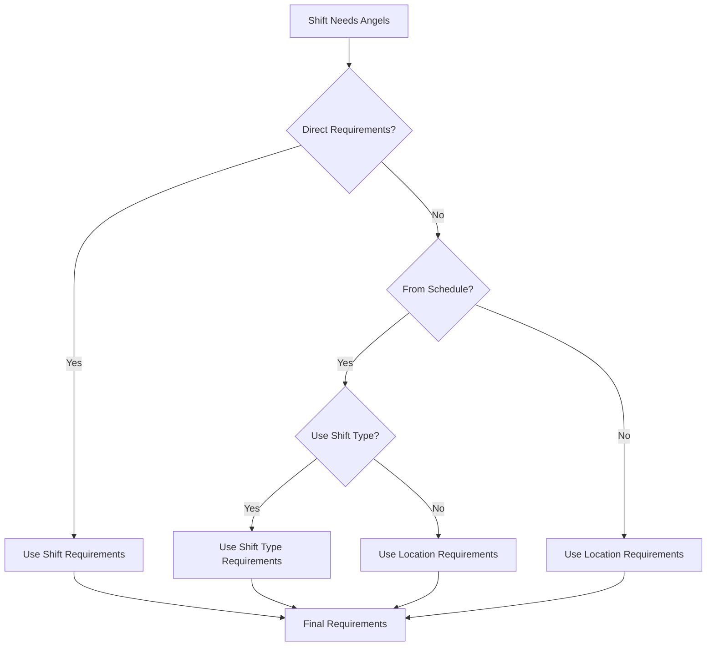
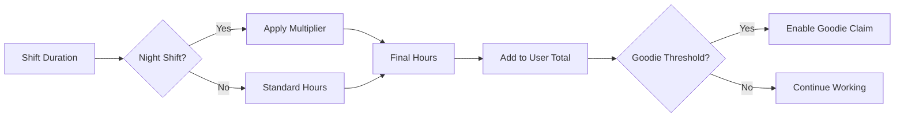

# Shift Assignment Flow

## Shift Creation to Completion

## Shift Entry State Machine

## Angel Type Requirement Resolution

Shifts can get their angel type requirements from multiple sources:

## Work Hour Calculation

