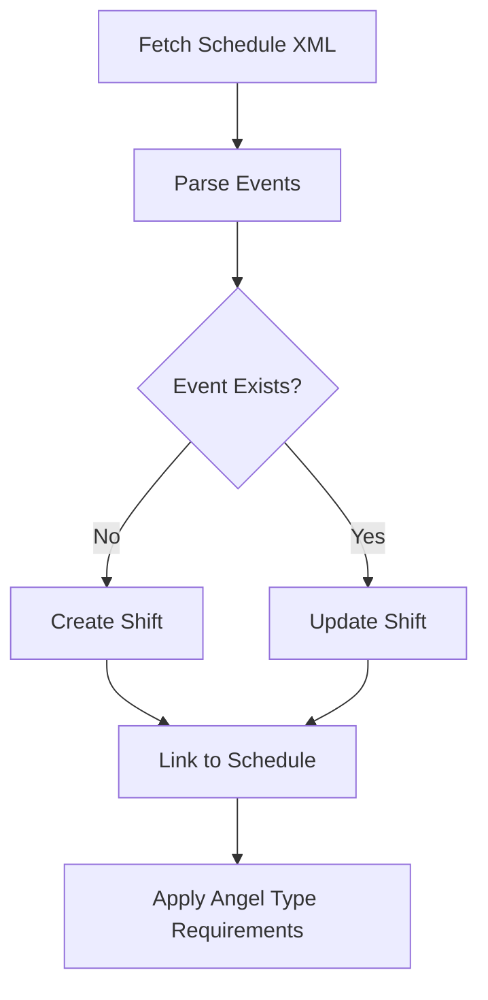

# External Systems Integration

## OAuth 2.0 Authentication

Engelsystem supports OAuth 2.0 for external authentication providers.

### Configuration

OAuth providers are configured in `config/config.php`:

```php
'oauth' => [
    'provider_name' => [
        'client_id'     => 'your-client-id',
        'client_secret' => 'your-client-secret',
        'url_auth'      => 'https://provider.com/oauth/authorize',
        'url_token'     => 'https://provider.com/oauth/token',
        'url_info'      => 'https://provider.com/api/user',
        'id'            => 'sub',           // Field for unique ID
        'username'      => 'preferred_username',
        'email'         => 'email',
        'first_name'    => 'given_name',
        'last_name'     => 'family_name',
        'url'           => null,            // Custom button URL
        'nested_info'   => false,           // Nested user info structure
        'hidden'        => false,           // Hide from login page
        'mark_arrived'  => false,           // Auto-mark users as arrived
        'groups'        => [],              // Default group assignments
    ],
],
```

### Supported Flows
- Authorization Code Grant
- Automatic user provisioning
- Group assignment based on OAuth claims

### Routes
- `GET /oauth/{provider}` - Initiate OAuth flow
- `GET /oauth/{provider}/connect` - Connect existing account
- `POST /oauth/{provider}/disconnect` - Disconnect OAuth

## Schedule Import (Frab/Pretalx)

### Overview

Engelsystem can import event schedules from Frab/Pretalx to automatically create shifts based on talks and events.

### Configuration

Schedules are managed via the admin interface:
- **Admin > Schedule Import**
- Add schedule URL (Frab/Pretalx XML endpoint)
- Configure shift type and location mappings
- Set needed angel types per schedule

### Import Process



### Schedule Properties
| Property | Description |
|----------|-------------|
| `url` | Schedule XML URL |
| `name` | Display name |
| `shift_type` | Default shift type for imports |
| `needed_from_shift_type` | Use shift type's angel requirements |
| `minutes_before` | Minutes before event to start shift |
| `minutes_after` | Minutes after event to end shift |

## iCal Export

### Personal Calendar

Users can subscribe to their personal shift calendar:
```
GET /ical?key={ical_key}
```

The `ical_key` is unique per user and available in profile settings.

### Location Calendars

Public calendars per location:
```
GET /locations/{id}/ical
```

### Calendar Properties
- Format: iCal (RFC 5545)
- Events include: shift title, description, location
- Timezone support based on config

## Webhooks [INFERRED]

The event system suggests webhook capability:
- `message.created` - New message events
- `news.created` - New news events
- `shift.entry.deleting` - Shift signup changes

[NEEDS VERIFICATION] Webhook endpoints may need to be implemented via event handlers.
