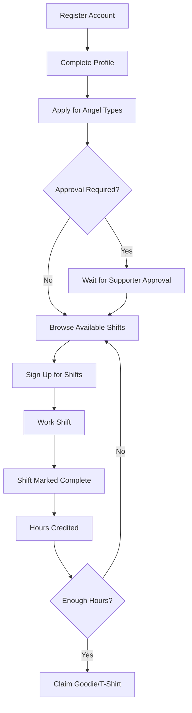

# Use Cases Overview

This section documents the primary use cases of Engelsystem.

## Core Workflows

### Volunteer (Angel) Use Cases
- [Shift Management](shift-management.md) - How shifts are created and managed
- [Volunteer Signup](volunteer-signup.md) - How volunteers sign up for shifts
- [User Management](user-management.md) - User registration and role management

### Administrative Use Cases
- Shift creation and bulk management
- Schedule import from external systems
- Angel type management
- Location configuration
- News and announcements

### Communication
- Internal messaging
- News announcements
- Question and answer system

## User Journey Overview

