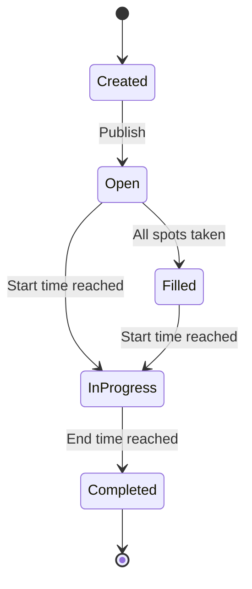

# Shift Management

## Overview

Shifts are the core work units in Engelsystem. They represent time-bounded volunteer assignments at specific locations.

## Actors

- **Shift Coordinator** - Creates and manages shifts
- **Angel** - Signs up for and works shifts
- **Supporter** - Approves angel type applications

## Creating Shifts

### Manual Creation

**Preconditions:**
- User has `shifts.edit` privilege
- Shift type exists
- Location exists

**Flow:**
1. Navigate to Admin > Shifts
2. Select date/time range
3. Choose location
4. Select shift type
5. Set title and description
6. Define needed angel types and counts
7. Save shift

### Bulk Creation

**Flow:**
1. Navigate to Admin > Shifts > Bulk
2. Define shift pattern (times, days)
3. Select multiple locations
4. Set angel type requirements
5. Generate shifts

### Schedule Import

**Preconditions:**
- Schedule URL configured
- Shift type mapping defined

**Flow:**
1. Navigate to Admin > Schedule Import
2. Add/select schedule
3. Trigger import
4. Review created shifts
5. Adjust as needed

## Shift Properties

| Property | Description | Required |
|----------|-------------|----------|
| `title` | Shift name | Yes |
| `description` | Details | No |
| `start` | Start time | Yes |
| `end` | End time | Yes |
| `location_id` | Where | Yes |
| `shift_type_id` | Category | Yes |
| `url` | Reference link | No |

## Needed Angel Types

Each shift defines how many volunteers of each type are needed:

```
Shift: "Info Desk Morning"
Needed:
  - Info Desk Angel: 2
  - Info Desk Supporter: 1
```

Requirements can be inherited from:
1. The shift itself (direct)
2. The location (for all shifts there)
3. The shift type (for all shifts of that type)
4. The schedule (for imported shifts)

## Night Shifts

Shifts during night hours receive bonus multipliers:

**Default Configuration:**
- Night hours: 2:00 - 6:00
- Multiplier: 2x

A shift is a night shift if it:
- Starts during night hours, OR
- Ends during night hours, OR
- Spans across night hours

## Shift States



## Editing Shifts

**Preconditions:**
- User has `shifts.edit` privilege

**Flow:**
1. Navigate to shift detail page
2. Click Edit
3. Modify properties
4. Save changes

**Constraints:**
- Cannot reduce angel count below current signups
- Schedule-imported shifts may have restrictions

## Deleting Shifts

**Preconditions:**
- User has `shifts.edit` privilege
- Consider impact on signed-up angels

**Flow:**
1. Navigate to shift detail page
2. Click Delete
3. Confirm deletion

**Side Effects:**
- Signed-up angels are notified
- Shift entries are removed
- Work hours are not credited
