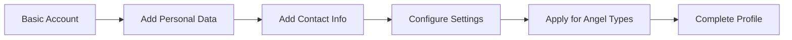

# User Management

## Overview

User management covers registration, authentication, profile management, and role assignment.

## User Registration

### Self-Registration

**Preconditions:**
- Registration is enabled (`registration_enabled` config)
- Valid email address

**Flow:**
1. User navigates to registration page
2. Enters: username, email, password
3. Agrees to terms (if configured)
4. Submits registration
5. System creates user in default group
6. User receives welcome notification

### OAuth Registration

**Preconditions:**
- OAuth provider configured
- Provider account exists

**Flow:**
1. User clicks OAuth provider button
2. Redirected to provider login
3. Authorizes Engelsystem access
4. Redirected back with OAuth data
5. System creates user from OAuth profile
6. User assigned to OAuth-configured groups

## User Profile

### Profile Sections

**Core Information:**
- Username (unique, login name)
- Email (for notifications)
- Password (hashed)

**Personal Data:**
- First name, last name
- Pronouns
- Planned arrival/departure dates
- T-shirt size

**Contact Information:**
- DECT phone number
- Mobile phone
- Public email

**Settings:**
- Language preference
- Theme selection
- Email notification preferences

### Profile Completion

## User States

| State | Description |
|-------|-------------|
| `arrived` | User has arrived at event |
| `active` | User is active volunteer |
| `force_active` | Admin-forced active status |
| `got_shirt` | User received goodie/shirt |
| `got_voucher` | Voucher count (can be > 1) |

### State Transitions

**Arrival:**
- User can self-mark arrived (if enabled)
- Or admin marks user as arrived
- Required before signing up for shifts (if configured)

**Getting Shirt:**
- Automatic when work hours reach threshold
- Manual by admin

## Group and Permission Management

### Groups

| Group | Description | Typical Privileges |
|-------|-------------|-------------------|
| Guest | Not logged in | View public info |
| Angel | Registered volunteer | Sign up for shifts |
| Shift Coordinator | Manages shifts | Create/edit shifts |
| Supporter | Approves angel types | Approve applications |
| Bureaucrat | Administrative | User management |
| Developer | Full access | All privileges |

### Assigning Groups

**Preconditions:**
- User has `admin_groups` privilege

**Flow:**
1. Navigate to user profile
2. Go to Groups section
3. Add/remove group memberships
4. Save changes

### Privileges

Fine-grained permissions:
- `user.arrive` - Mark users arrived
- `shifts.edit` - Edit shifts
- `angel_types` - Manage angel types
- `admin_groups` - Manage groups
- `admin_config` - System configuration
- And many more...

## User Search and Listing

### Search Capabilities
- By username
- By name (first/last)
- By email
- By DECT number

### Filtering
- By arrival status
- By group membership
- By angel type
- By shift signup status
