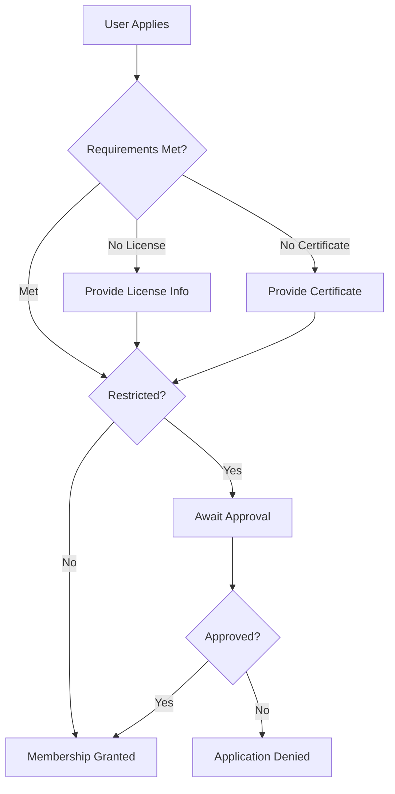
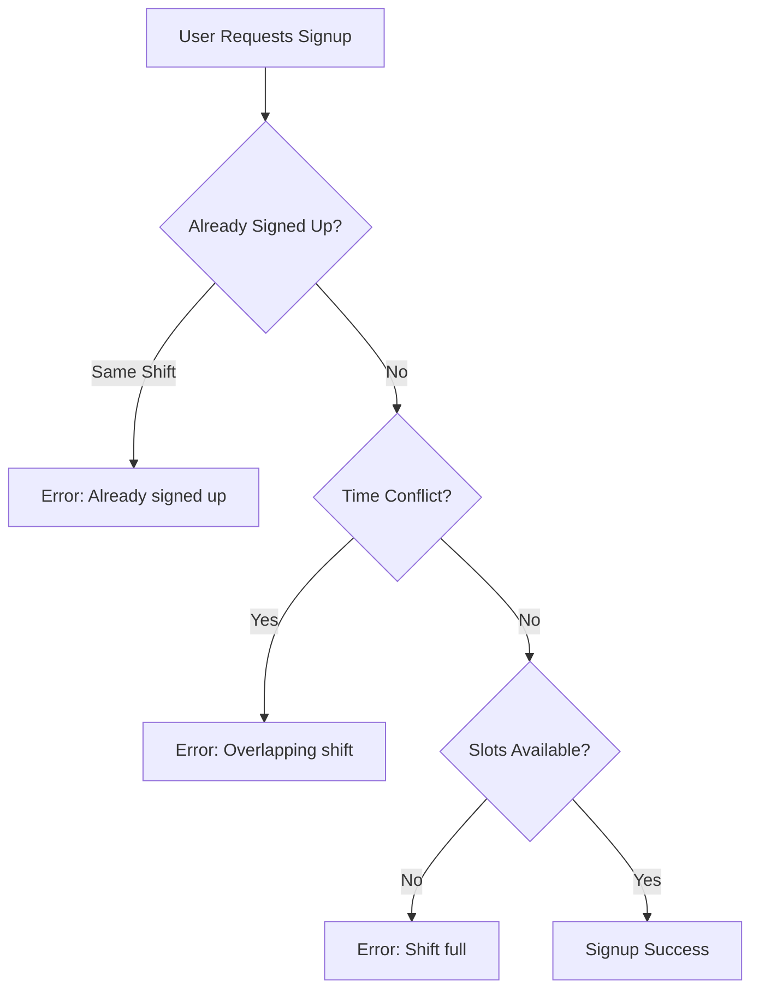

# Volunteer Signup

## Overview

The volunteer signup process connects angels (volunteers) with shifts they can work.

## Angel Type Application

### Overview

Before signing up for shifts, users must be qualified for the required angel types.

### Self-Signup Types

**Preconditions:**
- Angel type has `shift_self_signup` enabled
- User is logged in

**Flow:**
1. User views angel type page
2. Clicks "Join this angel type"
3. Immediately granted membership
4. Can sign up for shifts requiring this type

### Restricted Types

**Preconditions:**
- Angel type is restricted
- User is logged in

**Flow:**
1. User views angel type page
2. Clicks "Apply for this angel type"
3. Application created in pending state
4. Supporter notified
5. Supporter reviews application
6. Supporter approves or denies
7. User notified of decision

### Special Requirements

Some angel types have additional requirements:
- **Driver's License** - User must have valid license documented
- **IFSG Certificate** - Health certification required



## Shift Signup

### Viewing Available Shifts

**Routes:**
- `/shifts` - All shifts
- `/locations/{id}` - Shifts at location
- `/angeltypes/{id}` - Shifts for angel type

**Filters:**
- By date range
- By location
- By angel type
- By availability (unfilled only)

### Signing Up

**Preconditions:**
- User logged in
- User arrived (if required)
- User member of required angel type
- Shift has available slots
- No time conflict with existing signups

**Flow:**
1. User browses available shifts
2. Selects desired shift
3. Chooses angel type (if qualified for multiple)
4. Confirms signup
5. Shift entry created
6. User added to shift roster

### Shift Conflicts

The system prevents double-booking:


### Canceling Signup

**Preconditions:**
- User is signed up for shift
- Shift hasn't started (typically)

**Flow:**
1. User views their shifts
2. Selects shift to cancel
3. Confirms cancellation
4. Shift entry removed
5. Slot becomes available

## Freeloading

Users who don't show up for shifts get marked as "freeloaded":

**Process:**
1. Shift coordinator marks user as no-show
2. User receives freeload mark
3. After N freeload marks (`max_freeloadable_shifts`), user is restricted

**Consequences:**
- Reputation impact
- May lose shift signup privileges
- Admin notification

## Work Hours Tracking

### Automatic Tracking

Hours are credited when:
- Shift ends
- User marked as attended
- No freeload mark

**Calculation:**
```
hours = (shift.end - shift.start) * night_multiplier
```

### Manual Worklogs

Administrators can add manual work entries:
- For work outside scheduled shifts
- To correct tracking errors
- For special tasks

### Hour Goals

Configuration defines goodie thresholds:
```php
'goodie_tshirt' => [
    'hours' => 12,        // Hours needed for shirt
    'enabled' => true,
],
```
